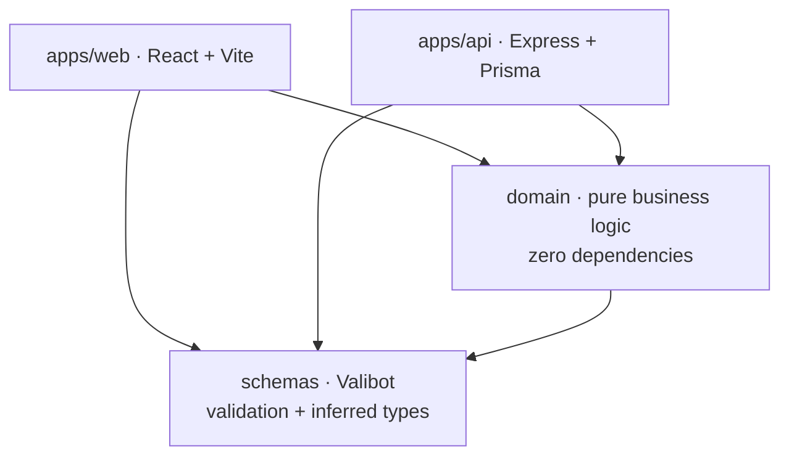

# Projektownia Calculator

[](https://github.com/michalik-maciej/projektownia-calculator/actions/workflows/ci.yml)

A quotation tool for retail shop fittings. You describe a store layout in terms of wall runs and
gondola units, and the app derives the bill of materials, groups it by component category and turns
it into a priced offer with a discount.

It is not a demo. It was built for a single real user, a shop-fitting designer who uses it to price
actual projects, and the domain model comes from how that work is really done rather than from an
invented example.

**Live:** https://projektownia.vercel.app · **Stack:** TypeScript everywhere, React + Express,
pnpm/Turborepo monorepo

> The link above shows a sign-in form, but there is no account to create: click **Demo**. Every
> click starts a fresh, isolated session with one priced example offer already loaded, so you land
> on a filled-in configuration instead of an empty one.


_The configurator. Run 1 is a wall run repeated twice, run 2 a double sided gondola shown side by
side with its end caps; the panel on the right edits whatever unit is selected. The interface is in
Polish, the language of the people who use it._

## What it computes

A layout is not a list of parts. A wall run is a height, a depth and a set of shelf units, each with
its own width and shelf configuration; a gondola is the double-sided variant. Turning that into
something you can price means resolving how many uprights, feet, legs, back panels, base shelves and
regular shelves the configuration actually implies, at which widths, and then costing them against a
component inventory.


_What that resolving produces: every component the two runs above imply, grouped by category and
summed across all layouts in the offer._

The `domain` package does exactly that and nothing else:

- `calculations/` — how many of one component a configuration needs
  (`calculateShelfDemand`, `calculateBackPanelDemand`, `calculateFootDemand`, `calculateLegDemand`,
  `calculateBaseShelfDemand`, `calculateBomPrice`)
- `transformations/` — pure mappings over a computed bill of materials
  (`breakdownDemandByCategory`, `countShelfUnitsByWidth`, `buildLayoutDescription`,
  `mapLayoutsToOfferOutput`)
- `orchestrations/` — compositions that produce a whole answer
  (`calculateWallLayoutDemand`, `calculateGondolaLayoutDemand`, `calculateOfferDemand`,
  `createOfferPreview`)
- `models/` and `fixtures/` — domain types, constraints and test data


_The same configuration as an offer: one line per run, a discount, and the two totals. The offer is
saved with the output it was quoted at, so reopening it later shows the numbers that were promised
rather than today's prices._

## Architecture



Two decisions carry the whole design.

**The domain package has no dependencies.** Not "few" — none. It knows nothing about Express,
React, Prisma or HTTP. That is what made it survive three full rewrites of everything around it
(see [Project history](#project-history)), and it is why the pricing logic can be tested as plain
functions with no test harness, no mocking and no database.

**Validation schemas are shared between the front end and the back end.** Valibot schemas in
`schemas/` are the single definition of what an offer, a layout or an inventory component is. The
API validates requests against them, the React forms validate input against them, and both sides
derive their TypeScript types from the same source with `v.InferOutput`. A change to the shape of a
layout cannot drift between client and server, because there is only one shape.

## Tech stack

| Layer      | Choice                                                                  |
| ---------- | ----------------------------------------------------------------------- |
| Language   | TypeScript (composite project references)                               |
| Front end  | React 19, Vite, TanStack Router, TanStack Query, react-hook-form        |
| UI         | Tailwind CSS v4, Radix UI primitives, class-variance-authority          |
| Back end   | Express, Prisma ORM                                                     |
| Database   | PostgreSQL (Neon)                                                       |
| Validation | Valibot, shared between client and server                               |
| Auth       | JWT, stateless, httpOnly cookies, bcrypt, offers scoped to their author |
| Monorepo   | pnpm workspaces + Turborepo                                             |
| Tests      | Vitest                                                                  |
| Quality    | ESLint 9, Prettier                                                      |
| Hosting    | Vercel (web), Fly.io (API, Docker)                                      |

The reasoning behind several of these is recorded in [`docs/decisions.md`](docs/decisions.md).

## Running locally

Requires Node 24+, pnpm 9+ and a PostgreSQL connection string.

```bash
pnpm install

# packages/apps/api/.env
#   DATABASE_URL=postgresql://localhost:5432/projektownia_calculator
#   JWT_SECRET=any-long-random-string
#   PORT=3000

# packages/apps/web/.env.local
#   VITE_API_URL=http://localhost:3000/api

pnpm --filter @projektownia-calculator/api exec prisma migrate deploy
pnpm --filter @projektownia-calculator/api exec prisma db seed

pnpm dev        # web on :5173, api on :3000
```

Open http://localhost:5173 and click **Demo**, the same button the live link uses. The seed always
loads the component catalogue, so the offer editor works immediately, no further setup needed.


_That catalogue is editable in the app. Which dimensions a component needs follows from its
category, so a foot asks for a depth and nothing else._

If you want to exercise the ordinary login form instead of the Demo button, set `ALLOW_DEMO_SEED=1`
before seeding and the seed also creates **demo@example.com** / **demo1234** as a plain `USER`
account. The password is published here on purpose: the deployment that holds real data is never
given that variable, so the account cannot exist there.

Other entry points: `pnpm dev:web`, `pnpm dev:api`, `pnpm build`.

## Tests and quality

```bash
pnpm test
pnpm test:coverage  # collected from the domain package
pnpm test:e2e       # one Playwright smoke test, needs a database
pnpm typecheck
pnpm lint
pnpm validate
```

Tests concentrate on the domain package, where the logic that can actually be wrong lives, plus
integration tests that exercise the API end to end. UI components are deliberately not unit-tested:
they are thin, and the interesting behaviour sits below them. One layer above that, `e2e/offer.spec.ts`
drives a real browser through the public entrance: it clicks **Demo**, configures a run and checks
that it comes back priced. It exists because the trade above assumes a maintainer who opens the app
to notice a regression, and a public demo is opened by people who will not report that it is broken.

**The suite needs no database.** The offer endpoints receive both the component inventory and the
offer storage as injected dependencies, wired in `createApp`, so the integration tests build an app
around a fixture catalogue and an in-memory store. That is what lets the ownership rules (a user
sees and edits only their own offers) be tested as HTTP requests, and the whole suite still runs
offline in about a second. Every command above, and the CI
workflow, runs on a clean clone with nothing installed but dependencies.

## Project history

The same problem has been rebuilt four times as the requirements and my own tooling changed:

| Repository                    | Period    | Approach                                        |
| ----------------------------- | --------- | ----------------------------------------------- |
| `projektownia-kalkulator`     | 2023–2024 | first working version                           |
| `next-calculator`             | 2024      | Next.js, Prisma, shadcn                         |
| `remix-calculator`            | 2024–2025 | Remix                                           |
| **`projektownia-calculator`** | 2025–2026 | monorepo, isolated domain layer, shared schemas |

Each rewrite replaced the framework. None of them replaced the domain rules, which is the argument
for keeping those rules in a package that depends on nothing.

## How this was built

Day-to-day work on this repository, including this README, is done with
[Claude Code](https://claude.com/claude-code) as a pair programmer, not unattended automation.
`CLAUDE.md` and `docs/standards/` are the standards the agent is told to follow; they were derived
from this codebase's own conventions, not imposed on it. Every change still goes through the same
gate: `pnpm validate` and the test suite pass before anything is reviewed, and the agent never
stages, commits or pushes on its own (`.claude/hooks/block-agent-git-writes.mjs` blocks it): that
stays a deliberate, manual step. A packaged multi-agent orchestrator was tried once on a real
feature and dropped (decision 10 in `docs/decisions.md`): useful for the standards it produced,
too much process for one maintainer working directly on `main`.

## Status

Feature-complete for its user's needs and in active use. Every push to `main` runs typecheck, lint,
formatting and the test suite (see the badge at the top). The live link's **Demo** button is a
public, one-click way to try it: no account, no waiting, and a priced example configuration from the
first screen.

## License

MIT, see [`LICENSE`](LICENSE).
