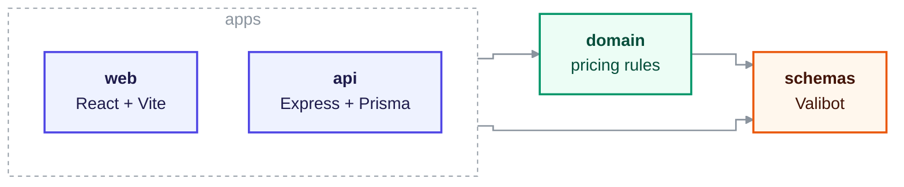

# Projektownia Calculator

Quotes for shop shelving: you lay out the shelves, it counts the parts and prices them.

[](https://github.com/michalik-maciej/projektownia-calculator/actions/workflows/ci.yml)
[](LICENSE)

**Try it: [projektownia.vercel.app](https://projektownia.vercel.app)** and click **Demo** on the
login screen. No account needed, you start with an example layout that is already priced.


## Why

Pricing a shelving system by hand means counting uprights, feet, legs, back panels and shelves across
several layouts, then looking up each price. It is slow, and a mistake gives you an offer that looks
fine and is wrong.

It was built for a shop-fitting designer who uses it to quote real projects. The UI is in Polish,
because that is who uses it.

## What it does

- Wall runs and double sided gondolas, each with its own height, depth and shelf units
- Turns a layout into a full bill of materials, grouped by component category
- Prices it against an editable component catalogue and applies a discount
- Saves each offer with the numbers it was quoted at, so reopening it later shows what was promised,
  not today's prices


## Quick start

You need Node 24+, pnpm 9+ and a PostgreSQL database.

```bash
pnpm install

# packages/apps/api/.env
#   DATABASE_URL=postgresql://localhost:5432/projektownia_calculator
#   JWT_SECRET=any-long-random-string
#   WEBAPP_DOMAIN=http://localhost:5173
# packages/apps/web/.env.local
#   VITE_API_URL=http://localhost:3000/api

pnpm --filter @projektownia-calculator/api exec prisma migrate deploy
pnpm --filter @projektownia-calculator/api exec prisma db seed
pnpm dev
```

Open http://localhost:5173 and click **Demo**. The seed loads the component catalogue, so there is
something to price straight away.

Want to test the normal login form instead? Seed with `ALLOW_DEMO_SEED=1` and sign in as
`demo@example.com` / `demo1234`. That account only exists where the variable is set, never in
production.

## How it's built

TypeScript monorepo (pnpm + Turborepo) with four packages:



- **`domain`** holds all the counting and pricing rules and depends on nothing. No React, no Express,
  no database. That is why it survived three rewrites of everything around it, and why it can be
  tested as plain functions.
- **`schemas`** are Valibot schemas shared by the API and the React forms. Both sides get their
  types from the same place, so the shape of an offer can't drift between them.

Stack: React 19, TanStack Router and Query, react-hook-form, Tailwind v4, Radix UI, Express 5,
Prisma, PostgreSQL on Neon. Hosted on Vercel (web) and Fly.io (API).

## Tests

```bash
pnpm test           # domain, API and a few UI tests
pnpm test:coverage  # coverage of the domain package
pnpm test:e2e       # Playwright smoke test, needs a database
pnpm validate       # typecheck, lint, format, build
```

Most tests sit in the domain package, because that is where a mistake costs money. API tests run
against an in-memory store, so the suite needs no database and finishes in seconds. UI components get
a test only when they have real logic in them. One Playwright test clicks through the public demo,
because people trying a demo don't report bugs, they just leave.

## History

This is the fourth version of the same calculator:

| Repository                    | Years     | What changed                                    |
| ----------------------------- | --------- | ----------------------------------------------- |
| `projektownia-kalkulator`     | 2023-2024 | first working version                           |
| `next-calculator`             | 2024      | Next.js, Prisma, shadcn                         |
| `remix-calculator`            | 2024-2025 | Remix                                           |
| **`projektownia-calculator`** | 2025-2026 | monorepo, isolated domain layer, shared schemas |

The framework changed every time. The pricing rules didn't, which is the reason they now live in a
package of their own.

## License

MIT, see [LICENSE](LICENSE).
